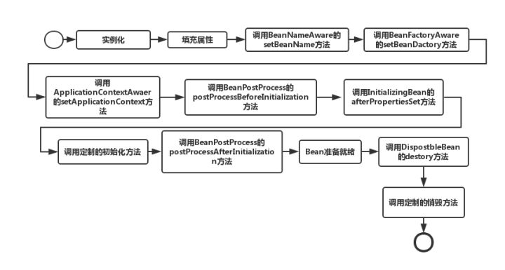

# Summary_About_Java

### spring学习总结


### IOC

```
IOC是一种设计思想；
Ioc意味着将你设计好的对象交给容器控制，而不是传统的在你的对象内部直接控制。
对于spring来说，就是spring(IOC容器)控制对象的生命周期
```

### DI

```
依赖注入：
组件之间依赖关系由容器在运行期决定，形象的说，即由容器动态的将某个依赖关系注入到组件之中。依赖注入的目的并非为软件系统带来更多功能，而是为了提升组件重用的频率，并为系统搭建一个灵活、可扩展的平台
IoC的一个重点是在系统运行中，动态的向某个对象提供它所需要的其他对象。这一点是通过DI（Dependency Injection，依赖注入）来实现的
```

[IOC和DI的理解](http://blog.csdn.net/qq_22654611/article/details/52606960/)


### spring bean生命周期



```
1.Spring对Bean进行实例化（相当于程序中的new Xx()）
2.Spring将值和Bean的引用注入进Bean对应的属性中
3.如果Bean实现了BeanNameAware接口，Spring将Bean的ID传递给setBeanName()方法（实现BeanNameAware清主要是为了通过Bean的引用来获得Bean的ID，一般业务中是很少有用到Bean的ID的）
4.如果Bean实现了BeanFactoryAware接口，Spring将调用setBeanDactory(BeanFactory bf)方法并把BeanFactory容器实例作为参数传入。（实现BeanFactoryAware 主要目的是为了获取Spring容器，如Bean通过Spring容器发布事件等）
5.如果Bean实现了ApplicationContextAwaer接口，Spring容器将调用setApplicationContext(ApplicationContext ctx)方法，把y应用上下文作为参数传入.(作用与BeanFactory类似都是为了获取Spring容器，不同的是Spring容器在调用setApplicationContext方法时会把它自己作为setApplicationContext 的参数传入，而Spring容器在调用setBeanDactory前需要程序员自己指定（注入）setBeanDactory里的参数BeanFactory )
6.如果Bean实现了BeanPostProcess接口，Spring将调用它们的postProcessBeforeInitialization（预初始化）方法（作用是在Bean实例创建成功后对进行增强处理，如对Bean进行修改，增加某个功能）
7.如果Bean实现了InitializingBean接口，Spring将调用它们的afterPropertiesSet方法，作用与在配置文件中对Bean使用init-method声明初始化的作用一样，都是在Bean的全部属性设置成功后执行的初始化方法。
8.如果Bean实现了BeanPostProcess接口，Spring将调用它们的postProcessAfterInitialization（后初始化）方法（作用与6的一样，只不过6是在Bean初始化前执行的，而这个是在Bean初始化后执行的，时机不同 )
9.经过以上的工作后，Bean将一直驻留在应用上下文中给应用使用，直到应用上下文被销毁
10.如果Bean实现了DispostbleBean接口，Spring将调用它的destory方法，作用与在配置文件中对Bean使用destory-method属性的作用一样，都是在Bean实例销毁前执行的方法。
```


